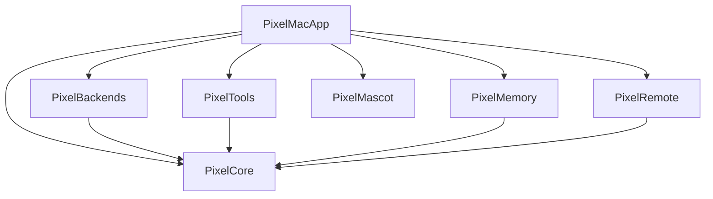

# pixel-agent

> Pixel-art mascot kılığında, macOS için kişisel bir AI ajanı — sohbet eder, dosyalarla çalışır, ekrana bakar, bilgisayarı kullanır.

<!-- BADGES (placeholder) -->


<!-- DEMO (placeholder) -->
<!--  -->

## Neden var?

İki amaç:

1. **Kişisel kullanım** — günlük macOS workflow'una entegre bir AI ajanı. Dosya okur, shell çalıştırır, ekran görüntüsü alır, kısa sohbete çekilir. Mascot olarak masaüstünde durur, sıkıldığında onunla konuşulur.
2. **Portfolio** — modüler Swift mimarisi, Swift Concurrency (TaskLocal scoping, actor isolation), test edilebilir tasarım örneği.

İlk versiyon (`pixel-agent2`, ~64k satır) hobi projesi olarak büyüdü. Bu, oradan öğrenilenlerle baştan yazılan ikinci sürüm.

## Mimari



Her modül kendi `XCTest` target'ıyla; bağımlılıklar `PixelCore`'a doğru, döngü yok.

Tam diyagram ve katman açıklaması: [docs/architecture.md](docs/architecture.md) *(hazırlanıyor)*

## Mimari kararlar

Her büyük tasarım kararı bir ADR (Architecture Decision Record) olarak belgelenir. Çekirdek set:

- ADR 0001 — Modüler SPM monorepo *(hazırlanıyor)*
- ADR 0002 — SwiftUI App lifecycle (`NSApplicationDelegate` yok) *(hazırlanıyor)*
- ADR 0003 — TaskLocal context propagation *(hazırlanıyor)*
- ADR 0004 — `ChatBackend` protokol soyutlaması *(hazırlanıyor)*
- ADR 0005 — `ToolArbiter` resource mutex *(hazırlanıyor)*
- ADR 0006 — JSONL append-only depolama *(hazırlanıyor)*
- ADR 0007 — Test izolasyonu (Mock backend + TaskLocal scoping) *(hazırlanıyor)*
- ADR 0008 — Remote envelope paylaşılan modül *(hazırlanıyor)*
- ADR 0009 — Dependency injection over singletons *(hazırlanıyor)*

Ayrıca: [docs/architecture-decisions-from-v2.md](docs/architecture-decisions-from-v2.md) — birinci sürümden çıkarılan 14 karar deseni ve 3 anti-pattern.

## Kurulum

```bash
git clone https://github.com/ErkutYavuzer/pixel-agent.git
cd pixel-agent
swift build
swift test
swift run PixelMacApp
```

Gereksinimler: macOS 14+, Swift 6.0+.

## Modüller

| Modül | Sorumluluk | Bağımlılık |
|---|---|---|
| `PixelCore` | `ChatBackend` protokolü, `Envelope` tipleri, TaskLocal scoping primitives | — |
| `PixelBackends` | LLM provider implementasyonları (MVP: Anthropic) | `PixelCore` |
| `PixelTools` | `ToolDispatcher`, `ToolArbiter`, 6 temel araç | `PixelCore` |
| `PixelMemory` | JSONL append-only conversation + memory deposu | `PixelCore` |
| `PixelMascot` | 48×48 pixel-art sprite render, state machine | — |
| `PixelRemote` | WebSocket envelope (Mac + iOS paylaşır) | `PixelCore` |
| `PixelMacApp` | SwiftUI App, composition root | hepsi |

## Durum

**Sprint:** Hafta 1 / 6 — Foundation
**Versiyon:** `0.0.0` (henüz tag yok)

| Hafta | Hedef | Durum |
|---|---|---|
| 1 | Foundation: monorepo, Package.swift, CI, lint, README, 9 ADR | 🔄 devam ediyor |
| 2 | Mac chat core: `PixelCore` + Anthropic backend + minimal SwiftUI pencere | ⏸ planlı |
| 3 | `PixelTools`: dispatcher + arbiter + 6 araç (read/write/list/shell/screenshot/web_fetch) | ⏸ planlı |
| 4 | `PixelMemory` JSONL + `PixelMascot` sprite + tool→mascot state | ⏸ planlı |
| 5 | iOS uzak istemci + Cloudflare Worker relay + pairing | ⏸ planlı |
| 6 | Polish: demo GIF, DocC GitHub Pages, v0.1.0 release | ⏸ planlı |

## Lisans

Henüz belirlenmedi.

## Teşekkür

İlk sürüm `pixel-agent2`'den öğrenilenler bu projenin kalbinde — özellikle `ToolArbiter` resource mutex'i, TaskLocal scoping ve ephemeral subagent isolation desenleri.
