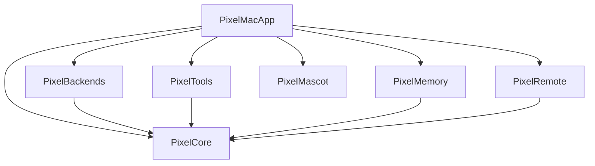

# pixel-agent

> Pixel-art mascot kılığında, macOS için kişisel bir AI ajanı — sohbet eder, dosyalarla çalışır, ekrana bakar, bilgisayarı kullanır.

<!-- BADGES -->


<!-- DEMO (placeholder) -->
<!--  -->

## Neden var?

İki amaç:

1. **Kişisel kullanım** — günlük macOS workflow'una entegre bir AI ajanı. Dosya okur, shell çalıştırır, ekran görüntüsü alır, kısa sohbete çekilir. Mascot olarak masaüstünde durur, sıkıldığında onunla konuşulur.
2. **Portfolio** — modüler Swift mimarisi, Swift Concurrency (TaskLocal scoping, actor isolation), test edilebilir tasarım örneği.

İlk versiyon (`pixel-agent2`, ~64k satır) hobi projesi olarak büyüdü. Bu, oradan öğrenilenlerle baştan yazılan ikinci sürüm.

## Mimari



Her modül kendi `XCTest` target'ıyla; bağımlılıklar `PixelCore`'a doğru, döngü yok.

Tam diyagram ve katman açıklaması: [docs/architecture.md](docs/architecture.md) *(hazırlanıyor)*

## Mimari kararlar

Her büyük tasarım kararı bir ADR (Architecture Decision Record) olarak belgelenir. Çekirdek set:

- ADR 0001 — Modüler SPM monorepo *(hazırlanıyor)*
- ADR 0002 — SwiftUI App lifecycle (`NSApplicationDelegate` yok) *(hazırlanıyor)*
- ADR 0003 — TaskLocal context propagation *(hazırlanıyor)*
- ADR 0004 — `ChatBackend` protokol soyutlaması *(hazırlanıyor)*
- ADR 0005 — `ToolArbiter` resource mutex *(hazırlanıyor)*
- ADR 0006 — JSONL append-only depolama *(hazırlanıyor)*
- ADR 0007 — Test izolasyonu (Mock backend + TaskLocal scoping) *(hazırlanıyor)*
- ADR 0008 — Remote envelope paylaşılan modül *(hazırlanıyor)*
- ADR 0009 — Dependency injection over singletons *(hazırlanıyor)*

Ayrıca: [docs/architecture-decisions-from-v2.md](docs/architecture-decisions-from-v2.md) — birinci sürümden çıkarılan 14 karar deseni ve 3 anti-pattern.

## Kurulum

```bash
git clone https://github.com/ErkutYavuzer/pixel-agent.git
cd pixel-agent
swift build
swift test
swift run PixelMacApp
```

Gereksinimler:
- macOS 14+
- Swift 6.0+
- Aşağıdaki CLI'lardan **en az biri** yüklü ve login olmalı:
  - [Claude Code CLI](https://github.com/anthropics/claude-code)
  - [OpenAI Codex CLI](https://github.com/openai/codex)
  - [Google Gemini CLI](https://github.com/google-gemini/gemini-cli)

Uygulama açılışta `claude`, `codex`, `gemini` binary'lerini PATH'te ve bilinen yollarda (`/usr/local/bin`, `/opt/homebrew/bin`, `~/.local/bin`, `~/bin`) tarar. Bulunanlar arasında segmented picker ile anlık geçiş yapabilirsiniz. API key veya ortam değişkeni gerekmez — CLI'ların kendi OAuth/login state'ini kullanır.

## Modüller

| Modül | Sorumluluk | Bağımlılık |
|---|---|---|
| `PixelCore` | `ChatBackend` protokolü, `Envelope` tipleri, TaskLocal scoping primitives | — |
| `PixelBackends` | LLM CLI wrapper'ları (`claude` / `codex` / `gemini` subprocess) + detection | `PixelCore` |
| `PixelTools` | Native macOS toolkit (DockBadge, SystemNotifications, SoundEffect) | `PixelCore` |
| `PixelMemory` | JSONL append-only `ConversationStore` actor (append + restore + arşiv) | `PixelCore` |
| `PixelMascot` | 48×48 pixel-art sprite (12×12 grid) + 4 state (idle/thinking/speaking/error) + SwiftUI Canvas render | — |
| `PixelRemote` | WebSocket envelope + ed25519 imza (`EnvelopeSigner` + `KeyStore`) + relay client + pairing protokolü | `PixelCore` |
| `PixelMCPServer` | MCP (Model Context Protocol) server library — JSON-RPC 2.0, tool registry, 5 saf-data tool (clipboard, time, active app, lan ip) | — |
| `pixel-mcp-server` | MCP server executable target — stdio transport, claude-cli ile uyumlu | `PixelMCPServer` |
| `PixelMacApp` | SwiftUI App, composition root | hepsi |

## Durum

**Versiyon:** `0.1.0` — ilk public release (21 May 2026)
**Test:** 91 yeşil
**ADR:** 13 belge

| Sprint | Hedef | Durum |
|---|---|---|
| Hafta 1 | Foundation: SPM monorepo, CI, lint, 9 ADR | ✅ |
| Hafta 2 | PixelCore tipleri + ChatBackend protokol + SwiftUI chat | ✅ |
| Hafta 2.5 | Anthropic API → CLI subprocess (claude/codex/gemini) | ✅ |
| Hafta 3 | PixelMascot 48×48 sprite + PixelTools native toolkit | ✅ |
| Hafta 4 | PixelMemory JSONL conversation store + Remote envelope | ✅ |
| Hafta 5 | Cloudflare Worker relay + RelayClient + PairingView + iOS source | ✅ |
| Hafta 6 | MIT lisansı + DocC GitHub Pages + iOS↔Mac bidirectional + v0.1.0 release | ✅ |

### iOS app & relay

iOS uzak istemci source dosyaları `ios/PixelAgentRemote/` altında; Xcode project setup için bkz. [ios/README.md](ios/README.md). Cloudflare Worker relay için bkz. [relay/README.md](relay/README.md). Pairing protokolü: [ADR-0013](docs/adr/0013-pairing-and-relay-protocol.md).

### v0.2 yol haritası

- ✅ `--output-format stream-json` parser (gerçek token-by-token streaming) — v0.2.2
- ✅ Multi-backend simultane (dual-agent paralel sohbet) — v0.2.1
- ✅ Ed25519 envelope signing (handshake + Faz 2 wire-up) — ADR-0015
- ✅ MCP server expose (Faz 1: stdio transport + 5 saf-data tool) — ADR-0016
- ☐ Plan Mode (read-only tool allowlist)
- ☐ Subagent dispatching (ephemeral runtime + budget)
- ☐ MCP server expose Faz 2 (bundle-bağımlı tool'lar — DockBadge, notify, sound)

## MCP server (claude-cli entegrasyonu)

pixel-agent kendi tool'larını [Model Context Protocol](https://modelcontextprotocol.io) standardı üzerinden expose eder. claude-cli ile entegrasyon için (`~/.claude.json`):

```json
{
  "mcpServers": {
    "pixel-agent": {
      "command": "/path/to/pixel-agent/.build/release/pixel-mcp-server",
      "args": []
    }
  }
}
```

Release build:

```bash
swift build -c release
ls .build/release/pixel-mcp-server   # ↑ command path bu
```

Stdio sanity check (claude-cli olmadan):

```bash
echo '{"jsonrpc":"2.0","id":1,"method":"tools/list"}' | swift run pixel-mcp-server
```

Detay: [ADR-0016](docs/adr/0016-mcp-server-expose.md).

## Lisans

MIT — bkz. [LICENSE](LICENSE).

## Teşekkür

İlk sürüm `pixel-agent2`'den öğrenilenler bu projenin kalbinde — özellikle `ToolArbiter` resource mutex'i, TaskLocal scoping ve ephemeral subagent isolation desenleri.
