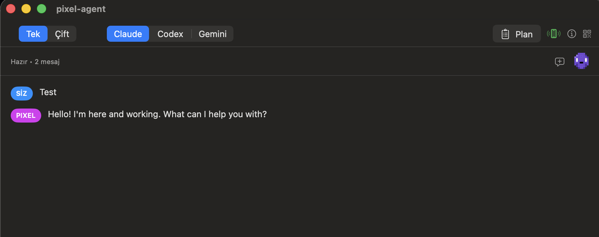
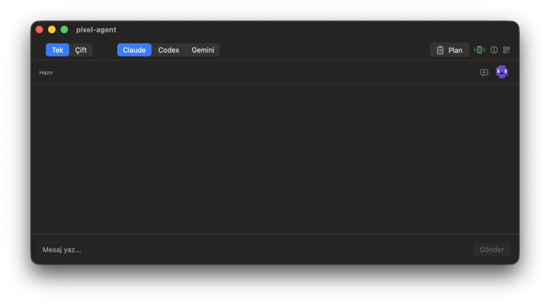
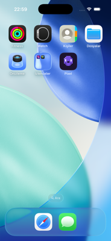
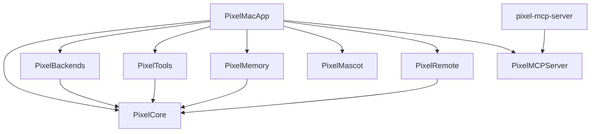

# pixel-agent

> Pixel-art mascot kılığında, macOS için kişisel bir AI ajanı — sohbet eder, iPhone'la eşleşir, kendi tool'larını başka LLM client'larına MCP ile sunar.


<p align="center">
  
</p>

<p align="center">
  <em>Tek/Çift backend modu (Claude · Codex · Gemini) · ed25519 imzalı iPhone pairing · Plan Mode read-only allowlist · macOS Dock mascot · MCP server expose (9 tool) · LAN-only transport (Bonjour) · 235 test yeşil · 23 ADR</em>
</p>

<details>
<summary>📸 Daha fazla görsel</summary>

| Mac (yeni başlangıç) | iPhone Home (icon) |
|---|---|
|  |  |

> Demo GIF script'i: `scripts/record-demo.sh` (macOS Screen Recording → ffmpeg/gifski → optimized GIF). `docs/assets/demo.gif` slot'a koymak için kullanılır.

</details>

## Neden var?

İki amaç:

1. **Kişisel kullanım** — günlük macOS workflow'una entegre bir AI ajanı. claude/codex/gemini CLI'larını tek arayüzden çağırır, iPhone'la pairing yapar, mascot olarak masaüstünde durur.
2. **Portfolio** — modüler Swift mimarisi, Swift 6 strict concurrency (TaskLocal scoping + actor isolation), ed25519 imzalı transport, MCP server expose; her büyük tasarım kararı bir ADR ile belgeli.

İlk sürüm `pixel-agent2` (~64k satır) hobi olarak büyüdü; tüm mantığı tek SPM target altında 246 dosya, 1463 satırlık AppDelegate god class içeriyordu. v3 bu birikim yerine [v2'nin mimari derslerinden](docs/architecture-decisions-from-v2.md) çıkarılan 14 desen + 3 anti-pattern ile sıfırdan yazıldı.

## Mimari



7 library + 2 executable target, her birinin kendi `XCTest` target'ı. Bağımlılıklar tek yönlü — `PixelCore`'a doğru. Modüller arası döngü SPM tarafından compile-time bloklanır.

Tam diyagram + sequence akışları: [docs/architecture.md](docs/architecture.md).

## Mimari kararlar (ADR)

Her büyük tasarım kararı [docs/adr/](docs/adr/) altında belgeli.

**Foundation (v0.1.0, Hafta 1-6):**
- [ADR-0001](docs/adr/0001-modular-spm-monorepo.md) Modüler SPM monorepo
- [ADR-0002](docs/adr/0002-swiftui-app-lifecycle.md) SwiftUI App lifecycle (`NSApplicationDelegate` yok)
- [ADR-0003](docs/adr/0003-tasklocal-context-propagation.md) TaskLocal context propagation
- [ADR-0004](docs/adr/0004-chatbackend-protocol-abstraction.md) `ChatBackend` protokol soyutlaması
- [ADR-0005](docs/adr/0005-toolarbiter-resource-mutex.md) `ToolArbiter` resource mutex
- [ADR-0006](docs/adr/0006-jsonl-append-only-storage.md) JSONL append-only depolama
- [ADR-0007](docs/adr/0007-test-isolation-mock-tasklocal.md) Test izolasyonu (MockBackend + TaskLocal)
- [ADR-0008](docs/adr/0008-remote-envelope-shared-module.md) Remote envelope paylaşılan modül
- [ADR-0009](docs/adr/0009-dependency-injection-over-singletons.md) DI over singletons
- [ADR-0010](docs/adr/0010-cli-subprocess-backend.md) CLI subprocess backend (HTTP API'yi sildi)
- [ADR-0011](docs/adr/0011-native-macos-toolkit.md) Native macOS toolkit (`PixelTools`)
- [ADR-0012](docs/adr/0012-remote-envelope-schema.md) Remote envelope şeması
- [ADR-0013](docs/adr/0013-pairing-and-relay-protocol.md) Pairing + relay protokolü

**v0.2.x:**
- [ADR-0014](docs/adr/0014-ios-app-store-assets.md) iOS App Store asset + privacy manifest
- [ADR-0015](docs/adr/0015-ed25519-envelope-signing.md) ed25519 envelope signing (Faz 1 + 2)
- [ADR-0016](docs/adr/0016-mcp-server-expose.md) MCP server expose Faz 1 (5 saf-data tool)
- [ADR-0017](docs/adr/0017-plan-mode.md) Plan Mode (`--permission-mode plan` + UI toggle)
- [ADR-0018](docs/adr/0018-mcp-bridge-unix-socket.md) MCP Faz 2 — Unix socket bridge (3 bundle-bağımlı tool)
- [ADR-0019](docs/adr/0019-subagent-runner.md) Subagent Runner Faz 1 (`PixelSubagent` library, budget'lı tek-turlu çalıştırıcı)
- [ADR-0020](docs/adr/0020-mcp-dispatch-subagent.md) Subagent Faz 2 — MCP tool `dispatch_subagent` (headless orchestration)
- [ADR-0021](docs/adr/0021-lan-mode-bonjour.md) LAN-only mode Faz 1 (`PixelLAN` library: Bonjour + Network.framework, relay bypass altyapısı)
- [ADR-0022](docs/adr/0022-remote-transport-adapter.md) LAN Faz 2 — `RemoteTransport` protocol + 4 adapter + `FallbackTransport`
- [ADR-0023](docs/adr/0023-merge-transport-and-mac-wire-up.md) LAN Faz 3 — `MergeTransport` paralel composite + PixelMacApp wire-up

Ayrıca: [docs/architecture-decisions-from-v2.md](docs/architecture-decisions-from-v2.md) — birinci sürümden çıkarılan 14 desen ve 3 anti-pattern.

## Kurulum

```bash
git clone https://github.com/ErkutYavuzer/pixel-agent.git
cd pixel-agent
swift build -c release
swift test                              # 235 yeşil
./scripts/build-app.sh release && open PixelAgent.app
```

Gereksinimler:
- macOS 14+
- Swift 6.0+
- Aşağıdaki CLI'lardan **en az biri** yüklü ve login olmalı:
  - [Claude Code CLI](https://github.com/anthropics/claude-code)
  - [OpenAI Codex CLI](https://github.com/openai/codex)
  - [Google Gemini CLI](https://github.com/google-gemini/gemini-cli)

Uygulama açılışta `claude`, `codex`, `gemini` binary'lerini PATH'te ve bilinen yollarda (`/usr/local/bin`, `/opt/homebrew/bin`, `~/.local/bin`, `~/bin`) tarar. Bulunanlar arasında **Tek/Çift** mod picker ile anlık geçiş. API key veya env var gerekmez — CLI'ların kendi OAuth/login state'ini kullanır.

## Modüller

| Modül | Sorumluluk | Bağımlılık |
|---|---|---|
| `PixelCore` | `ChatBackend` protokolü, `ChatOptions`, `Message`/`StreamDelta`, `AgentContext` TaskLocal | — |
| `PixelBackends` | CLI wrapper (`claude` / `codex` / `gemini` subprocess), `CLIDetector`, `StreamJSONParser`, `CodexJSONParser` | `PixelCore` |
| `PixelTools` | Native macOS toolkit: `DockBadge`, `SystemNotifications`, `SoundEffect` | `PixelCore` |
| `PixelMemory` | `ConversationStore` actor (JSONL append-only + archive) | `PixelCore` |
| `PixelMascot` | 48×48 pixel-art sprite (12×12 ASCII grid), 4 state, SwiftUI `Canvas` render | — |
| `PixelRemote` | `RemoteEnvelope` (Codable + sig), `EnvelopeSigner` (ed25519), `KeyStore` (Keychain/InMemory), `RelayClient` + `RelayTransport`, `RemoteHost`, `RemoteTransport` protocol, `PairingCode` | `PixelCore` |
| `PixelLAN` | Bonjour LAN bypass: `LANService` + `LANClient` (Network.framework), `LANServerTransport` / `LANClientTransport` / `FallbackTransport` adapter'ları | `PixelRemote` |
| `PixelSubagent` | Tek-turlu subagent çalıştırıcı: `Budget` (wallclock + byte cap), `SubagentResult` enum, `SubagentRunner` actor (worker + watchdog yarışı) | `PixelCore` |
| `PixelMCPServer` | MCP server library: `JSONValue`, `JSONRPCMessage`, `MCPServer` actor, `ToolRegistry`, `BridgeProtocol`, `BridgeClient` | — |
| `PixelMacApp` (exe) | SwiftUI App composition root, `ChatView`, `PairingView`, `ControlSocketServer` | hepsi |
| `pixel-mcp-server` (exe) | MCP stdio executable — `main.swift` 3 satır, `MCPServer.runStdio()` | `PixelMCPServer` |

## Durum

**Versiyon:** `v0.2.9` (22 May 2026) · **235 test** yeşil · **23 ADR** · 9 library + 2 executable target · **end-to-end iPhone test'i** doğrulandı

### Sürüm geçmişi

| Sürüm | Tarih | Öne çıkan | Test |
|---|---|---|---|
| `v0.1.0` | 21 May | İlk release: 6 sprint, iOS pairing iskeleti, MIT, DocC | 91 |
| `v0.2.1` | 21 May | Dual-agent paralel sohbet | — |
| `v0.2.2` | 21 May | Claude `--output-format stream-json` parser | — |
| `v0.2.3` | 22 May | iOS App Store hazırlık + ed25519 Faz 1+2 + MCP Faz 1 ⚠️ proto v1→v2 | 162 |
| `v0.2.4` | 22 May | Plan Mode + MCP Faz 2 (Unix socket bridge) | 177 |
| `v0.2.5` | 22 May | Subagent Runner Faz 1 + dokümantasyon konsolidasyonu | 192 |
| `v0.2.6` | 22 May | Subagent Faz 2 — MCP tool `dispatch_subagent` | 195 |
| `v0.2.7` | 22 May | LAN-only mode Faz 1+2 — `PixelLAN` + `RemoteTransport` + 4 adapter + `FallbackTransport` | 226 |
| `v0.2.8` | 22 May | LAN Faz 3 — `MergeTransport` + PixelMacApp wire-up (Mac side LAN+Relay paralel) | 235 |
| `v0.2.9` | 22 May | Hotfix: Info.plist `NSLocalNetworkUsageDescription` + `NSBonjourServices` + repo public | 235 |

### v0.2 yol haritası

- ✅ stream-json parser (v0.2.2)
- ✅ Dual-agent paralel sohbet (v0.2.1)
- ✅ Codex CLI desteği
- ✅ iOS App Store asset + privacy manifest (ADR-0014)
- ✅ ed25519 envelope signing — Faz 1+2 (ADR-0015)
- ✅ MCP server expose — Faz 1+2 (ADR-0016 + ADR-0018, 8 tool)
- ✅ Plan Mode (ADR-0017)
- ◐ Subagent dispatching — Faz 1 (ADR-0019, `PixelSubagent` library) + Faz 2 (ADR-0020, MCP `dispatch_subagent` tool) landed; Faz 3+ UI panel + multi-turn workflow + streaming defer
- ◐ LAN-only mode — Faz 1 (ADR-0021) + Faz 2 (ADR-0022) + Faz 3 (ADR-0023, `MergeTransport` + Mac LAN+Relay paralel) landed; Faz 4 iOS LAN-first default + TXT record + indicator defer
- ☐ App Store signing + submission

## iOS app & relay

iOS uzak istemci source dosyaları `ios/PixelAgentRemote/` altında; xcodegen flow için bkz. [ios/README.md](ios/README.md). Cloudflare Worker relay için bkz. [relay/README.md](relay/README.md). Pairing protokolü: [ADR-0013](docs/adr/0013-pairing-and-relay-protocol.md). ed25519 imzalı handshake: [ADR-0015](docs/adr/0015-ed25519-envelope-signing.md).

## MCP server (claude-cli entegrasyonu)

pixel-agent kendi tool'larını [Model Context Protocol](https://modelcontextprotocol.io) standardı üzerinden expose eder — claude-cli ve uyumlu istemciler kullanabilir. claude-cli config'i (`~/.claude.json`):

```json
{
  "mcpServers": {
    "pixel-agent": {
      "command": "/path/to/pixel-agent/.build/release/pixel-mcp-server",
      "args": []
    }
  }
}
```

Release build:

```bash
swift build -c release
ls .build/release/pixel-mcp-server     # ↑ command path bu
```

**Tool'lar (9 toplam):**

| Tool | Tür | PixelAgent.app gerektirir mi? |
|---|---|---|
| `get_clipboard`, `set_clipboard` | saf-data | hayır |
| `get_current_time` | saf-data | hayır |
| `get_active_app` | saf-data | hayır |
| `get_lan_ip` | saf-data | hayır |
| `dock_badge_set` | bridge | **evet** (Unix socket) |
| `notify` | bridge | **evet** |
| `play_sound` | bridge | **evet** |
| `dispatch_subagent` | bridge | **evet** (PixelMacApp `SubagentRunner` invoke eder) |

Stdio sanity check (claude-cli olmadan):

```bash
echo '{"jsonrpc":"2.0","id":1,"method":"tools/list"}' | swift run pixel-mcp-server
```

Detay: [ADR-0016](docs/adr/0016-mcp-server-expose.md) + [ADR-0018](docs/adr/0018-mcp-bridge-unix-socket.md).

## Lisans

MIT — bkz. [LICENSE](LICENSE).

## Teşekkür

İlk sürüm `pixel-agent2`'den öğrenilenler bu projenin kalbinde — özellikle `ToolArbiter` resource mutex'i, TaskLocal scoping ve ephemeral subagent isolation desenleri. v2'den çıkarılan ders setinin tamamı: [docs/architecture-decisions-from-v2.md](docs/architecture-decisions-from-v2.md).
