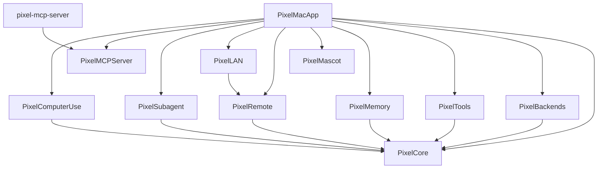

# pixel-agent

<p align="center">
  <strong>🇬🇧 English</strong> · <a href="README_TR.md">🇹🇷 Türkçe</a>
</p>

> **Personal AI agent for macOS** — chat with Claude/Codex/Gemini side by side, dispatch subagents in parallel, see and control your screen via Set-of-Mark, run your tools as an MCP server, and steer everything from your iPhone.


<p align="center">
  
</p>

<p align="center">
  <em>Native Swift · Multi-LLM · iOS remote dashboard · MCP server (14 tools) · Subagent UI · Computer use with Set-of-Mark · 443 tests · 32 ADRs</em>
</p>

<details>
<summary>📸 More screenshots</summary>

| Mac (fresh launch) | iPhone home (icon) |
|---|---|
|  |  |

> Demo GIF script: `scripts/record-demo.sh` (macOS Screen Recording → ffmpeg/gifski). Drops a recording into `docs/assets/demo.gif`. A polished demo lands with v0.3.

</details>

---

## What pixel-agent does

Most "AI desktop apps" are an Electron wrapper around a single chat. **pixel-agent is a native macOS power-user tool** built around five capabilities you don't usually get together:

- **Multi-CLI orchestration** — talk to Claude Code, Codex, and Gemini side by side (single or dual chat), each with its own conversation history.
- **Subagent panel** — fan out work to up to **3 parallel subagents** with a budget (wall-clock + bytes), cancellable from the UI or via the MCP `dispatch_subagent` tool.
- **iOS remote dashboard** — pair your iPhone with a QR code; from the phone, change the backend/model, toggle Plan Mode, request a screenshot, watch CPU/RAM in real time, cancel subagents. Works over LAN (Bonjour) or Cloudflare relay, with ed25519-signed envelopes.
- **Built-in MCP server** — `pixel-mcp-server` exposes **14 tools** to any MCP client (Claude Code, Cline, Continue, Cursor): clipboard, time, dock badge, notifications, sound, screenshot, dispatch_subagent, plus 5 `ui_*` AX-first tools (query, click, type, screenshot, resolve).
- **Computer use with Set-of-Mark** — AX-first hybrid UI control (per [ADR-0026](docs/adr/0026-pixel-computer-use.md)). Annotate a screenshot with numbered badges so a vision model can say "click #5" — deterministic ID → element mapping, no coordinate guessing.

Plus the things you'd expect: Plan Mode read-only allowlist (per [ADR-0017](docs/adr/0017-plan-mode.md)), JSONL conversation persistence, swappable backends, ToolArbiter resource mutex, ed25519 envelope signing, Bonjour LAN-first transport with relay fallback, and a pixel-art mascot in the corner.

## Why pixel-agent vs ...

| Feature | pixel-agent | Claude Desktop | [Cline](https://github.com/cline/cline) | [Aider](https://github.com/Aider-AI/aider) |
|---|---|---|---|---|
| Native macOS (60 MB) | ✅ Swift | ❌ Electron (~600 MB) | ❌ (VS Code) | ❌ (terminal) |
| Multi-LLM side by side | ✅ Dual chat | ❌ | ❌ | ❌ |
| iPhone remote dashboard | ✅ TabView (chat + subagents + Mac panel) | ❌ | ❌ | ❌ |
| MCP server (expose tools) | ✅ 14 tools | ❌ client only | ❌ | ❌ |
| Subagent UI (parallel) | ✅ cap=3 | ❌ | ❌ | ❌ |
| Computer use | ✅ AX-first + Set-of-Mark | ❌ | ❌ via tools | ❌ |
| Plan Mode toggle | ✅ | ❌ | ❌ | ❌ |
| Open source | ✅ MIT | ❌ | ✅ Apache | ✅ Apache |
| Architecture docs | ✅ 32 ADRs | — | — | — |

Pick pixel-agent if you live on macOS, run multiple CLIs, want an iPhone remote, build MCP tools, or care about portfolio-grade Swift architecture.

## Quickstart (5 minutes)

### 1. Install at least one supported CLI

pixel-agent uses your local CLI binaries — no API keys to configure inside the app. Install whichever you have access to:

- [Claude Code CLI](https://github.com/anthropics/claude-code)
- [OpenAI Codex CLI](https://github.com/openai/codex)
- [Google Gemini CLI](https://github.com/google-gemini/gemini-cli)

Make sure `claude`, `codex`, or `gemini` is on your `PATH` (or in `/opt/homebrew/bin`, `/usr/local/bin`, `~/.local/bin`, `~/bin`) and that you've logged in to that CLI.

### 2. Install

**Option A — Homebrew (recommended, ~30 seconds)**

```bash
HOMEBREW_CASK_OPTS="--no-quarantine" brew install --cask ErkutYavuzer/tap/pixel-agent
open /Applications/PixelAgent.app
```

> The `HOMEBREW_CASK_OPTS` env var bypasses macOS Gatekeeper for this install. pixel-agent is currently ad-hoc signed (Apple Developer ID + notarization is on the roadmap). Without it you'd need to manually `xattr -d com.apple.quarantine /Applications/PixelAgent.app` or right-click → "Open Anyway" in System Settings → Privacy & Security.

Tap source: [ErkutYavuzer/homebrew-tap](https://github.com/ErkutYavuzer/homebrew-tap).

**Option B — Build from source**

```bash
git clone https://github.com/ErkutYavuzer/pixel-agent.git
cd pixel-agent
swift build -c release
swift test                              # 443 passing
./scripts/build-app.sh release && open PixelAgent.app
```

Requirements: macOS 14+ (Sonoma), Apple Silicon (arm64). Swift 6.0+ only for build-from-source. Intel universal2 build is on the roadmap.

### 3. (Optional) Pair with iPhone

1. In the Mac app, open the Pairing view → a QR code appears.
2. On your iPhone, build [`ios/PixelAgentRemote`](ios/) via xcodegen (`cd ios && xcodegen generate && open PixelAgentRemote.xcodeproj`) and run it.
3. Scan the QR. Connection persists across launches; LAN is preferred, Cloudflare relay is the fallback.

### 4. (Optional) Expose pixel-agent's tools to other MCP clients

`pixel-mcp-server` is a standalone executable. Point your MCP client at it:

```json
{
  "mcpServers": {
    "pixel-agent": {
      "command": "/absolute/path/to/.build/release/pixel-mcp-server",
      "args": []
    }
  }
}
```

Tools that require the Mac app (dock badge, notify, dispatch_subagent, `ui_*`) only work when `PixelAgent.app` is running — they talk to it over a Unix socket bridge.

Stdio sanity check:

```bash
echo '{"jsonrpc":"2.0","id":1,"method":"tools/list"}' | swift run pixel-mcp-server
```

## Feature tour

### Multi-backend chat

Single mode picks one CLI; **Dual mode runs two side by side** so you can A/B answers or hand a task between models. Each backend has its own per-kind conversation history (`conversation-claude.jsonl`, etc.).

Per-backend model picker is in the toolbar — Anthropic aliases (`opus`/`sonnet`/`haiku`, always current) at the top, dated IDs below for pinning.

### Subagent dispatching

A dedicated panel shows up to **3 parallel subagents** with elapsed time, partial streaming output, and a cancel button. The same runtime is exposed as the MCP tool `dispatch_subagent` so other clients (or pixel-agent itself, recursively) can fan out work.

Per [ADR-0019](docs/adr/0019-subagent-runner.md) → [ADR-0024](docs/adr/0024-subagent-ui-panel.md).

### iOS remote dashboard

Three-tab `TabView`:
- **Chat** — full chat with streaming + exponential backoff reconnect.
- **Subagents** — see and cancel what's running on the Mac.
- **Mac Panel** — change backend, model, plan mode from the phone; request a screenshot (zoomable); watch real CPU + RAM gauges (Mach `HOST_CPU_LOAD_INFO`).

Per [ADR-0032](docs/adr/0032-ios-dashboard-control-protocol.md).

### Computer use with Set-of-Mark

`PixelComputerUse` is AX-first (Accessibility tree) with an OCR fallback toggle. The new piece is **Set-of-Mark visual annotation** — overlay numbered badges on a screenshot so a vision model can say "click #7", and pixel-agent maps the ID to the real element deterministically. No more "pixel coordinates please" workflow.

```text
1. ui_query({ role: "AXButton", bundle_id: "com.app.foo" }) → [10 elements]
2. ui_screenshot({ target: "window_content", bundle_id: "com.app.foo", elements: <ui_query result> })
   → { png_base64, marks: [{ id: "1", element, frame_in_image }, ...] }
3. Vision model reads PNG + marks → "click #7"
4. ui_click({ query: { identifier: marks[6].element.identifier } })
```

Per [ADR-0026](docs/adr/0026-pixel-computer-use.md) → [ADR-0031](docs/adr/0031-set-of-mark-annotation.md).

### MCP server — 14 tools

| Tool | Type | Needs Mac app? |
|---|---|---|
| `get_clipboard`, `set_clipboard` | pure data | no |
| `get_current_time` | pure data | no |
| `get_active_app` | pure data | no |
| `get_lan_ip` | pure data | no |
| `dock_badge_set` | bridge | **yes** (Unix socket) |
| `notify` | bridge | **yes** |
| `play_sound` | bridge | **yes** |
| `dispatch_subagent` | bridge | **yes** |
| `ui_query`, `ui_click`, `ui_type`, `ui_screenshot`, `ui_resolve` | bridge (`PixelComputerUse`) | **yes** |

Plan Mode is enforced: when active, only read-only `ui_query`/`ui_screenshot`/`ui_resolve` are allowed.

## Architecture



**10 libraries + 2 executables**, each with its own `XCTest` target. Dependencies flow one-way toward `PixelCore`; cycles are blocked at SPM compile time. Swift 6 strict concurrency throughout (`swiftLanguageModes: [.v6]`).

| Module | Responsibility |
|---|---|
| `PixelCore` | `ChatBackend` protocol, `ChatOptions`, `Message`/`StreamDelta`, `AgentContext` TaskLocal, `ToolArbiter` |
| `PixelBackends` | CLI subprocess wrappers (`claude`/`codex`/`gemini`), `CLIDetector`, `ModelCatalog`, `StreamJSONParser` |
| `PixelTools` | Native macOS toolkit: `DockBadge`, `SystemNotifications`, `SoundEffect` |
| `PixelMemory` | `ConversationStore` actor (JSONL append-only, per-backend isolation) |
| `PixelMascot` | 12×12 ASCII sprite, 4 animation states, SwiftUI `Canvas` renderer |
| `PixelRemote` | `RemoteEnvelope` (Codable + ed25519 sig), `RelayClient`, `RemoteHost`, transport protocol |
| `PixelLAN` | Bonjour: `LANService`/`LANClient`, transport adapters, `FallbackTransport`, `MergeTransport` |
| `PixelSubagent` | Single-turn runner: `Budget`, `SubagentResult` enum, `SubagentRunner` actor |
| `PixelMCPServer` | `JSONValue`, `JSONRPCMessage`, `MCPServer` actor, `ToolRegistry`, bridge protocol |
| `PixelComputerUse` | AX bridge, pointer control, screenshot capture, Set-of-Mark renderer |
| `PixelMacApp` (exe) | SwiftUI composition root, `ChatView`, `PairingView`, `ControlSocketServer`, `SystemStats` |
| `pixel-mcp-server` (exe) | MCP stdio executable (3-line `main.swift`) |

Full diagram + sequence flows: [docs/architecture.md](docs/architecture.md).

## Architectural decisions (ADR)

Every major design decision is written down as an [ADR](docs/adr/). The full set is 32 documents covering monorepo layout, lifecycle, concurrency, transport, signing, MCP, subagents, computer use, and the iOS dashboard protocol.

Highlights:

- [ADR-0001](docs/adr/0001-modular-spm-monorepo.md) Modular SPM monorepo
- [ADR-0010](docs/adr/0010-cli-subprocess-backend.md) CLI subprocess backend (HTTP API rejected)
- [ADR-0015](docs/adr/0015-ed25519-envelope-signing.md) ed25519 envelope signing
- [ADR-0016](docs/adr/0016-mcp-server-expose.md) + [ADR-0018](docs/adr/0018-mcp-bridge-unix-socket.md) MCP server expose + Unix socket bridge
- [ADR-0021](docs/adr/0021-lan-mode-bonjour.md) → [ADR-0025](docs/adr/0025-lan-first-ios-default.md) LAN-only mode (4 phases)
- [ADR-0026](docs/adr/0026-pixel-computer-use.md) → [ADR-0031](docs/adr/0031-set-of-mark-annotation.md) Computer use (6 phases incl. Set-of-Mark)
- [ADR-0032](docs/adr/0032-ios-dashboard-control-protocol.md) iOS dashboard remote control protocol

Plus a retrospective: [v2 lessons](docs/architecture-decisions-from-v2.md) — 14 patterns and 3 anti-patterns extracted from the predecessor codebase that informed v3.

## Status

**v0.2.25** (2026-05-23) · **443 tests** passing · **32 ADRs** · 10 libraries + 2 executables · end-to-end iPhone test verified.

Recent highlights ([full changelog](CHANGELOG.md)):

| Version | Date | Highlight | Tests |
|---|---|---|---|
| `v0.2.25` | 23 May | iOS dashboard, real CPU metric (Mach `HOST_CPU_LOAD_INFO`), ADR-0032 | 443 |
| `v0.2.16` | 23 May | Set-of-Mark visual annotation (ADR-0031) | 401 |
| `v0.2.12` | 23 May | PixelComputerUse + ToolArbiter implementation | 315 |
| `v0.2.11` | 22 May | LAN-first iOS default + Bonjour TXT record | 250 |
| `v0.2.10` | 22 May | Subagent UI panel, parallel cap=3 | 244 |
| `v0.2.3` | 22 May | ed25519 envelope signing + MCP server expose | 162 |
| `v0.1.0` | 21 May | First release (6 sprints, iOS pairing, DocC) | 91 |

Roadmap: see [CHANGELOG → Unreleased](CHANGELOG.md#unreleased) for what's coming next.

## Documentation

- [Architecture](docs/architecture.md) — full diagram + sequence flows
- [ADR index](docs/adr/) — 32 architectural decisions
- [v2 lessons](docs/architecture-decisions-from-v2.md) — what informed v3
- [CHANGELOG](CHANGELOG.md)
- [SECURITY](SECURITY.md)
- API docs (DocC): published to [GitHub Pages](https://erkutyavuzer.github.io/pixel-agent/) by `.github/workflows/docs.yml`

## Contributing

- 🐛 [File a bug](https://github.com/ErkutYavuzer/pixel-agent/issues/new?template=bug_report.yml)
- ✨ [Suggest a feature](https://github.com/ErkutYavuzer/pixel-agent/issues/new?template=feature_request.yml)
- 💬 [Discuss an idea](https://github.com/ErkutYavuzer/pixel-agent/discussions)
- 🔒 Security: please follow [SECURITY.md](SECURITY.md) for responsible disclosure
- PR convention: see [pull_request_template.md](.github/pull_request_template.md)

This is a personal portfolio project; scope is intentionally bounded (see CHANGELOG → Unreleased for the roadmap). Architectural proposals should reference an existing ADR or propose a new one — keep the trail.

## License

MIT — see [LICENSE](LICENSE).

## Credits

Lessons from the predecessor `pixel-agent2` codebase are at the heart of this project — especially the `ToolArbiter` resource mutex, TaskLocal scoping, and ephemeral subagent isolation patterns. The full extracted set lives in [docs/architecture-decisions-from-v2.md](docs/architecture-decisions-from-v2.md).

---

<p align="center">
  <em>Built with <strong>Swift 6</strong> for macOS. Made in Türkiye 🇹🇷.</em>
</p>
