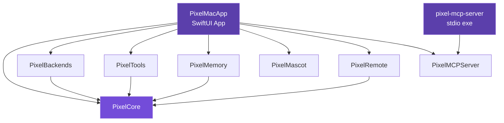
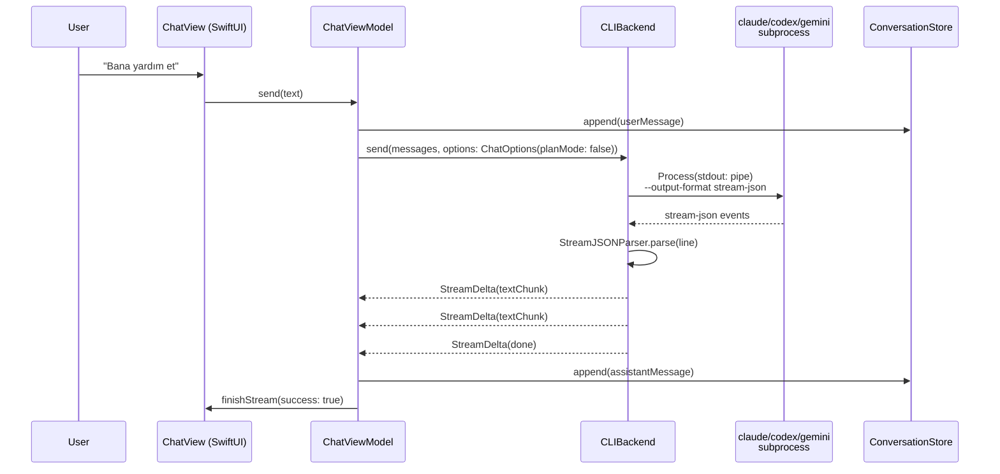
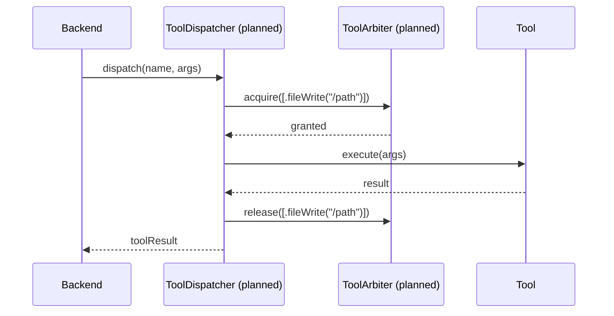
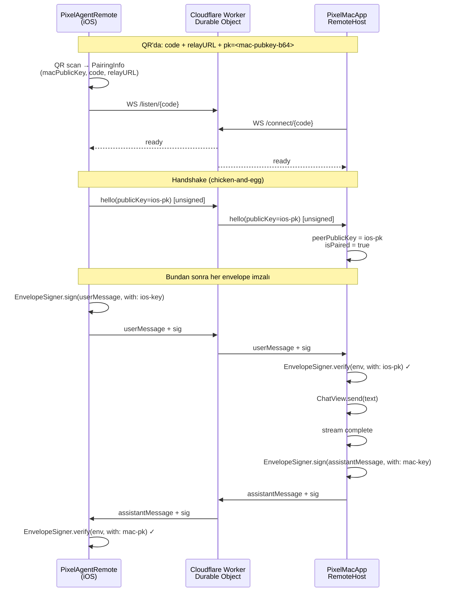
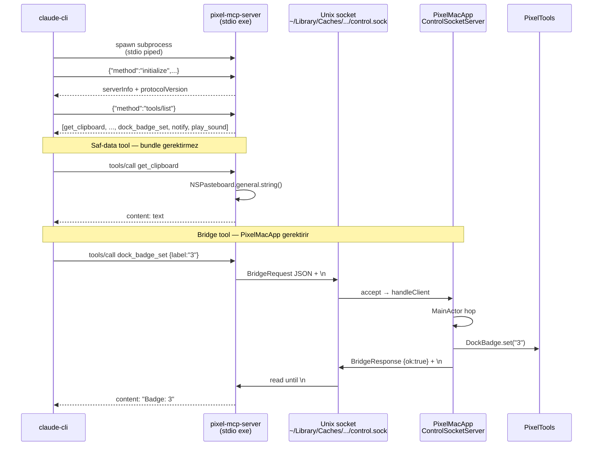

# pixel-agent Architecture

> Son güncelleme: v0.2.13 (23 May 2026). 10 library + 2 executable target, 338 test, 28 ADR.

## Modül grafiği

**Bağımlılık disiplini:** Tüm oklar `PixelCore` ya da yan modüllere doğru. Hiçbir library `PixelMacApp`'i import etmez (compile-time bloklanır). İki executable target var: `PixelMacApp` (GUI) ve `pixel-mcp-server` (CLI); ikincisi PixelMCPServer dışında hiçbir şeye bağımlı değildir, böylece minimum binary size + standalone deploy.

## Sohbet akışı

**Plan Mode** (ADR-0017): `ChatOptions(planMode: true)` Claude için `--permission-mode plan` flag'i ekler — read-only tool allowlist. Codex/Gemini'de no-op.

**Dual mode**: `DualChatHost` aynı user prompt'unu iki ChatViewModel'a paralel gönderir; her birinin ayrı `conversation-{kind}.jsonl` dosyası vardır.

## Tool dispatch akışı (planned, henüz aktif değil)

v3 MVP'sinde dahili tool dispatch henüz yok — CLI subprocess'lerin kendi tool çalıştırma akışı (claude'un Read/Edit/Bash tool'ları) bizim sorumluluğumuz dışında. `ToolArbiter` (ADR-0005) tasarımı v0.3+ için reserve:

TaskLocal context (`currentAgent`, `currentSubagentID`) tüm zincir boyunca propagate olur (ADR-0003). Şu an `AgentContext` PixelCore'da hazır, ancak dispatch zinciri henüz inşa edilmedi.

## Mac ↔ iOS imzalı kanal (landed v0.2.3 + v0.2.4)

Relay payload'ları görür ama imzalayamaz — relay compromise olsa MITM mümkün değil. Anahtar yönetimi: `KeychainKeyStore` (`kSecAttrAccessibleAfterFirstUnlock`); test'lerde `InMemoryKeyStore`. Detay: [ADR-0015](adr/0015-ed25519-envelope-signing.md).

## MCP server akışı (Faz 1 + Faz 2)

PixelMacApp çalışmıyorsa bridge tool'lar `connect()` ECONNREFUSED → `isError: true` content. Saf-data tool'lar her durumda çalışır. Detay: [ADR-0016](adr/0016-mcp-server-expose.md) + [ADR-0018](adr/0018-mcp-bridge-unix-socket.md).

## Katman dağılımı

| Katman | Sorumluluk | Modüller |
|---|---|---|
| **UI** | SwiftUI view'lar, scene lifecycle, toolbar | `PixelMacApp` |
| **Orchestration** | Sohbet akışı, agent state, composition root | `PixelMacApp` (`ChatViewModel`, `DualChatHost`, `ChatHost`) |
| **Domain protocols** | `ChatBackend`, `Envelope`, `ChatOptions`, TaskLocal | `PixelCore` |
| **Implementations** | CLI subprocess, JSONL store, mascot render | `PixelBackends`, `PixelMemory`, `PixelMascot` |
| **Native services** | macOS bundle-bağımlı toolkit | `PixelTools` |
| **Remote / IPC** | WebSocket envelope + ed25519 imza; Unix socket bridge | `PixelRemote`, `PixelMCPServer` (`BridgeProtocol`) |
| **External transport** | MCP stdio executable | `pixel-mcp-server` |

## Tasarım prensipleri

1. **Modüler SPM monorepo** (ADR-0001) — her sorumluluk kendi library target'ında; cross-module bağımlılık döngüsü compile-time bloklanır.
2. **SwiftUI App lifecycle** (ADR-0002) — `NSApplicationDelegate` god class anti-pattern'i (v2'de 5.277 satır) yapısal olarak engellenmiş.
3. **TaskLocal context propagation** (ADR-0003) — agent/subagent kimliği çağrı ağacında otomatik geçer; explicit param yok.
4. **Protocol-driven abstraction** (ADR-0004) — yeni LLM provider eklemek tek dosya yazımı; tek koşul: bir CLI binary'si olsun (ADR-0010).
5. **DI over singletons** (ADR-0009) — composition root'ta resolve; `ToolArbiter.shared` istisna (gerçek fiziksel kaynak mutex'i).
6. **Append-only storage** (ADR-0006) — durability + portability; Core Data/SQLite yok.
7. **Hermetic testing** (ADR-0007) — `MockBackend` + `TaskLocal` scoping; network'siz, deterministic, paralel-safe.
8. **Cross-platform shared module** (ADR-0008) — `RemoteEnvelope` Mac + iOS arasında tek noktadan tanımlı; cross-repo sync derdi yok.
9. **Signed transport** (ADR-0015) — Mac ↔ iOS arasında her envelope ed25519 imzalı; relay compromise immune.
10. **No backwards-compatibility hacks** — protocol break gerekiyorsa kırılır (v0.2.3'te `protocolVersion 1 → 2`); kod temiz kalır.

## v2'den çıkarılan dersler

Tüm liste: [docs/architecture-decisions-from-v2.md](architecture-decisions-from-v2.md).

Üç kritik anti-pattern v3'te yapısal olarak engellendi:
- **AppDelegate god class** (v2: 5.277 satır, 11 extension dosyası) → SwiftUI App lifecycle (ADR-0002)
- **Global backend singleton** → DI ile composition root'tan resolve (ADR-0009)
- **Cross-repo envelope sync derdi** (v2: 1100 satır iOS kodu Mac receiver yokken commit edilemedi) → `PixelRemote` paylaşılan modül (ADR-0008)
