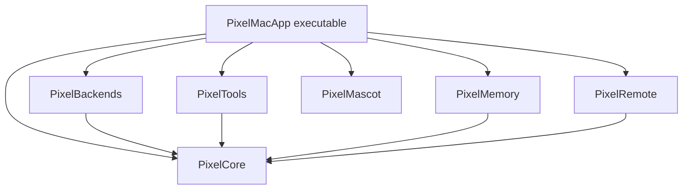
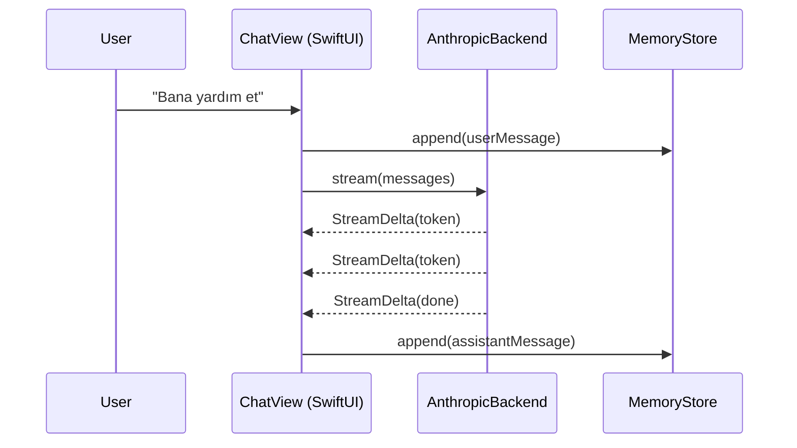
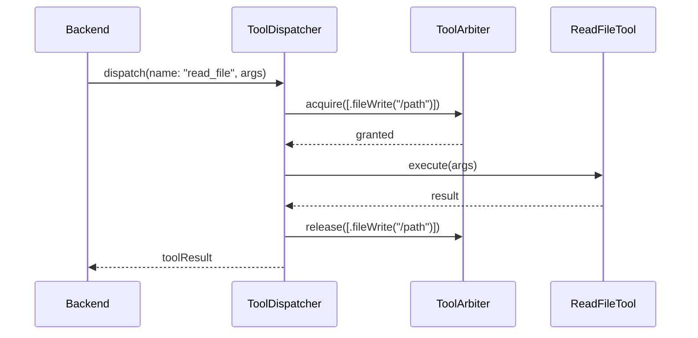
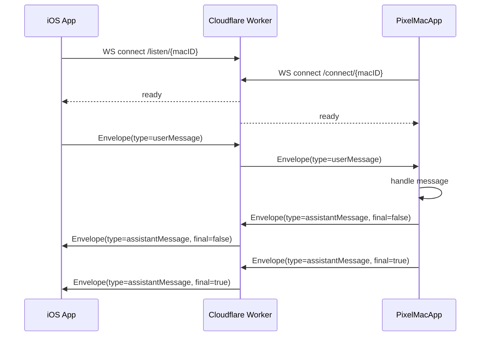

# pixel-agent Architecture

## Modül grafiği

**Bağımlılık disiplini:** Tüm oklar `PixelCore`'a doğru. Hiçbir modül `PixelMacApp`'i import etmez. Modüller arası bağımlılık döngüsü SPM tarafından compile-time bloklanır.

## Sohbet akışı (planned, Hafta 2)

## Tool dispatch akışı (planned, Hafta 3)

TaskLocal context (`currentAgent`, `currentSubagentID`) tüm zincir boyunca propagate olur (ADR-0003).

## Future: Mac ↔ iOS akışı (planned, Hafta 5)

Envelope tipleri `PixelRemote` modülünde tanımlı; her iki tarafta aynı Swift kodu (ADR-0008).

## Katman dağılımı

| Katman | Sorumluluk | Modüller |
|---|---|---|
| **UI** | SwiftUI view'lar, scene lifecycle | `PixelMacApp` |
| **Orchestration** | Sohbet akışı, agent state, scenedeki business logic | `PixelMacApp` (composition root) |
| **Domain protocols** | `ChatBackend`, `Envelope`, TaskLocal primitives | `PixelCore` |
| **Implementations** | Provider, tool, storage somut sınıflar | `PixelBackends`, `PixelTools`, `PixelMemory` |
| **Cross-cutting** | Mascot render, remote protocol | `PixelMascot`, `PixelRemote` |

## Tasarım prensipleri

1. **Dependency injection over singletons** (ADR-0009) — `ToolArbiter.shared` istisna, kalan her şey injected.
2. **TaskLocal scoping over global state** (ADR-0003) — context çağrı ağacında propagate olur.
3. **Protocol-driven abstraction** (ADR-0004) — yeni provider eklemek tek dosya yazımı.
4. **Hermetic testing** (ADR-0007) — network'siz, deterministic test suite.
5. **Append-only storage** (ADR-0006) — durability + portability.
